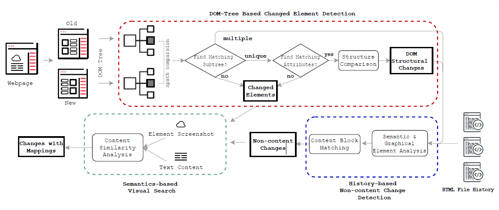

# WebEvo
Implementation of the paper WEBEVO: Taming Web Application Evolution via Semantic Change Detection.
## Introduction
In this work, we combined DOM-tree based comparison of old and new version of a web page, non-content change detection module by leveraging semantic, and visual information which identifies relevant structural changes together to monitor changes in a website.

## Requirements
+ JAVA Version: 1.8
## Usage
The major components of WebEvo are listed below:

1. DOM Structure Comparison.

We use the old and new versions of a web page as inputs to our DOM-tree Based Changed Element Detection module to detect changes on a web page based on DOM tree structures. 

+ Input.

Old and new version of a web page.

+ Output.

Changes in the DOM tree structure.
  
To run the jar file:
```bash
java -jar api-monitor-0.0.1-SNAPSHOT-jar-with-dependencies.jar -oldpage: <old version of the web page> -newpage: <new version of the web page>
```

api-monitor-0.0.1-SNAPSHOT-jar-with-dependencies.jar is in [Dom Structure Comparison]()

2. Non-content Change Detection.
  
3. Graphic Image Analysis.
## Acknowledgement
[Vista](https://github.com/saltlab/vista)  
